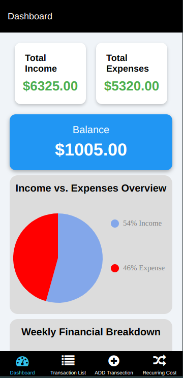
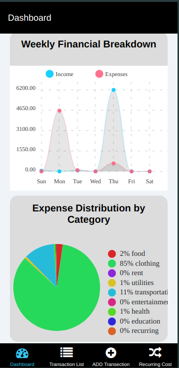
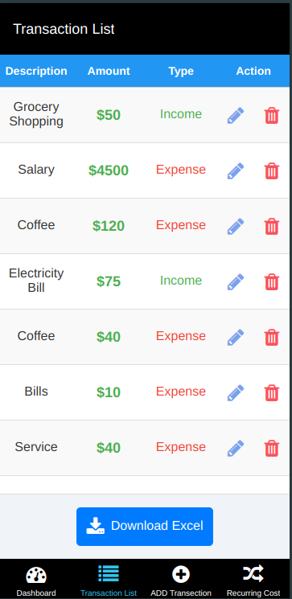
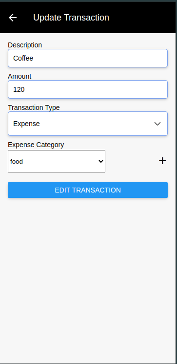
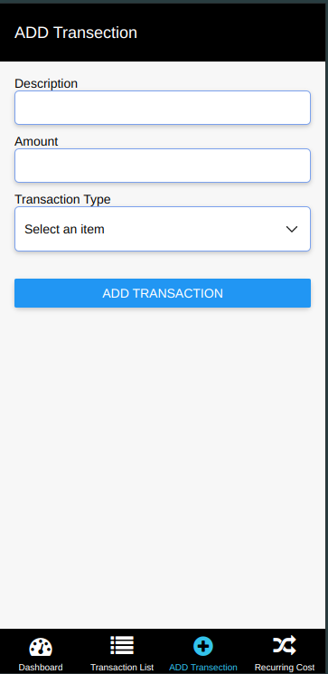
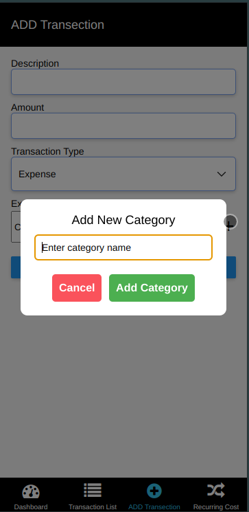
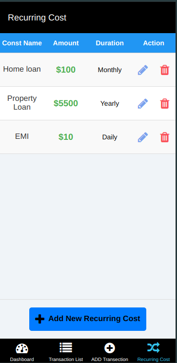
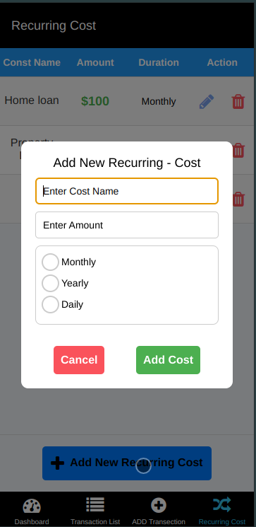
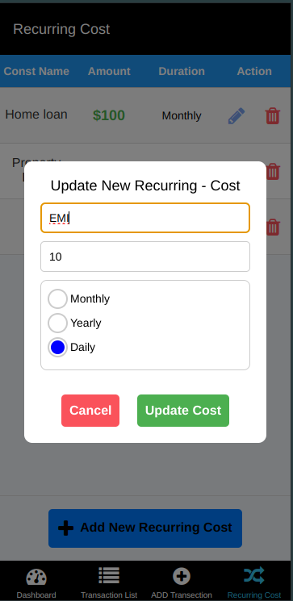

# Income Expense Management App

## Overview

The Income Expense Management App is a React Native application built with Expo CLI, designed to help users easily track and manage their finances. This app provides a comprehensive set of features for monitoring income, expenses, and recurring costs.

## Features

1. **Dashboard**

   - Overview of financial health
   - Total Income & Expense summary
   - Total Balance display
   - Data Visualization:
     - Income vs. Expense Pie Chart
     - Weekly Financial Breakdown (Line Chart)
     - Expense Distribution by Category (Pie Chart)

   
   <br>
   

2. **Transaction List**

   - Table view of all financial transactions
   - Update and delete individual transactions
   - Download transaction list as Excel file

   
   <br>
   

3. **Add Transaction**

   - Easily record new financial transactions
   - Dynamic category selection for expenses
   - Option to add custom categories

   
   <br>
   

4. **Recurring Costs**

   - Manage regular expenses (loans, EMIs, subscriptions)
   - Automatic addition of recurring costs to the transaction list
   - Add, edit, and delete recurring costs

   
   <br>
   
   <br>
   

## Installation

To set up the project locally, follow these steps:

1. Clone the repository:

   ```
   ssh://git@192.168.0.106:28039/github-demo/mobile/rn-income-expense-app.git
   ```

2. Navigate to the project directory:

   ```
   cd rn-income-expense-app
   ```

3. Install dependencies:

   ```
   npm install
   ```

4. Start the Expo development server:
   ```
   expo start
   ```

## Usage

After launching the app, you can:

- View your financial overview on the Dashboard
- Add new transactions using the Add Transaction screen
- Manage your transactions in the Transaction List
- Set up and manage Recurring Costs

For detailed instructions on using each feature, please refer to the user guide provided in the project documentation.

## Contributing
  - Contributions are welcome! To contribute to the project, follow these steps:
    - Fork the repository
    - Create a new branch: <code>git checkout -b my-feature-branch</code>
    - Make your changes and commit them: <code>git commit -am 'Add some feature'</code>
    - Push your changes to your branch: <code>git push origin my-feature-branch</code>
    - Create a new pull request and explain your changes
In the project directory, you can run:

